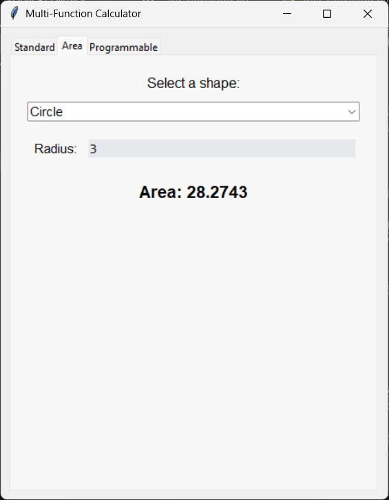
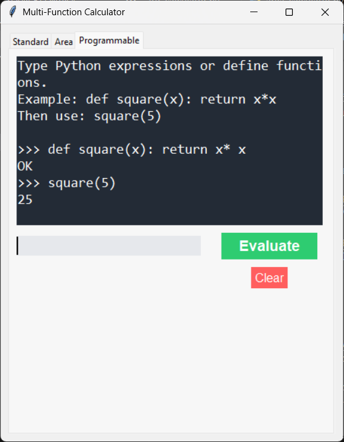

# Multi-Functional Calculator

A versatile desktop calculator application built with Python and Tkinter, combining multiple calculator types into a single, user-friendly, tabbed interface.

## Features

- **Unified Interface:** A clean, tabbed layout to easily switch between different calculator modes.
- **Standard Calculator:** For all your day-to-day arithmetic needs. Features a modern design with clear buttons and a responsive display.
- **Area Calculator:** A handy tool for students and professionals. Quickly calculate the area of various geometric shapes:
    - Circle
    - Triangle
    - Square
    - Rectangle
- **Programmable Calculator:** A mini Python REPL (Read-Eval-Print Loop) that allows you to:
    - Execute multi-line Python expressions.
    - Define and use variables.
    - Create and call your own functions.

## Screenshots

**Tab 1: Standard Calculator**

<br/><br/>
**Tab 2: Area Calculator**

<br/><br/>
**Tab 3: Programmable Calculator**



## Prerequisites

- [Python 3.x](https://www.python.org/downloads/)
- Tkinter (usually included with standard Python installations on Windows and macOS)

*Note for Linux users: You may need to install Tkinter separately using your package manager, e.g., `sudo apt-get install python3-tk`.*

## How to Run

1.  Ensure you have all the project files in the same directory:
    - `main_app.py`
    - `standard_calculator.py`
    - `area_calculator.py`
    - `programmable_calculator.py`

2.  Open your terminal or command prompt.

3.  Navigate to the directory where you saved the files.

4.  Run the main application file:
    ```bash
    python main_app.py
    ```

## Code Structure

The project is organized into modular, class-based components for clarity and maintainability.

-   `main_app.py`: The main entry point for the application. It creates the main window and the tabbed notebook interface that houses the other calculators.
-   `standard_calculator.py`: Contains the `StandardCalculator` class, which defines the UI and logic for the standard arithmetic calculator.
-   `area_calculator.py`: Contains the `AreaCalculator` class. It provides a dynamic UI for selecting a shape and calculating its area in real-time.
-   `programmable_calculator.py`: Contains the `ProgrammableCalculator` class, which implements a simple Python environment for executing code.
